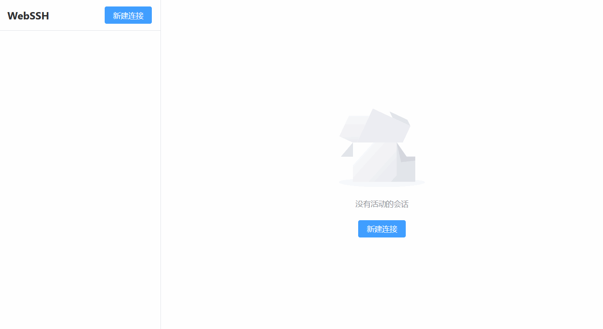

# WebSSH - Web版SSH客户端

基于 Vite + Vue3 + TypeScript 开发的现代化 Web SSH 客户端，提供流畅的终端体验和强大的会话管理功能。



## 功能特性

### SSH连接管理
- [✅] 支持密码认证方式
- [✅] 基础连接配置
- [✅] 会话管理
- [✅] 连接状态管理
- [✅] 自动重连机制
- [✅] 错误处理和提示
- [ ] 连接历史记录
- [ ] 配置持久化

### 终端模拟
- [✅] 基础终端功能
- [✅] 终端大小自适应
- [✅] 数据缓冲和恢复
- [✅] 会话内容保持


### 多会话管理
- [✅] 多会话支持
- [✅] 会话切换
- [✅] 会话内容缓存
- [✅] 会话状态同步
- [ ] 分屏功能
- [ ] 会话克隆
- [ ] 会话持久化

## 技术栈

### 前端
- 框架：Vue 3 + TypeScript
- 构建工具：Vite
- 终端模拟：Xterm.js
- 状态管理：Pinia
- UI组件：Element Plus
- 通信：WebSocket
- UUID生成：uuid

### 后端
- 运行环境：Node.js
- SSH连接：ssh2
- 通信协议：WebSocket
- 会话管理：自定义会话服务

## 快速开始

1. 克隆项目
```bash
git clone git@github.com:id88/webssh.git
cd webssh
```

2. 安装依赖
```bash
# 安装前端依赖
npm install

# 安装后端依赖
cd server
npm install
cd ..
```

3. 启动服务
```bash
# 启动后端服务
cd server
npm run dev

# 新开终端，启动前端服务
npm run dev
```

## 项目结构

```
webssh/
├── src/                # 前端源码
│   ├── components/     # 组件
│   │   ├── terminal/   # 终端相关组件
│   │   └── connection/ # 连接管理组件
│   ├── services/       # 服务
│   │   └── websocket.ts # WebSocket服务
│   ├── stores/         # Pinia 状态管理
│   ├── types/          # TypeScript 类型定义
│   ├── utils/          # 工具函数
│   └── views/          # 页面视图
├── server/             # 后端服务
│   ├── src/           # 后端源码
│   │   ├── services/  # 服务实现
│   │   │   ├── ssh.ts      # SSH服务
│   │   │   └── websocket.ts # WebSocket服务
│   │   └── types/     # 类型定义
│   └── package.json   # 后端依赖
└── package.json       # 前端依赖
```

## 使用指南

### 连接到服务器
1. 在主界面点击"新建连接"按钮
2. 填写服务器信息：
   - 主机地址（IP或域名）
   - SSH端口（默认22）
   - 用户名
   - 密码
3. 点击"连接"按钮开始会话

### 会话操作
- 可以同时打开多个SSH会话
- 通过左侧会话列表切换不同的会话
- 点击会话右侧的关闭按钮断开会话
- 会话内容会自动保存，切换会话时自动恢复

### 错误处理
- 连接失败时会显示具体的错误原因
- 密码错误时保持连接并允许重试
- WebSocket断开时自动重连
- 超时和网络错误有清晰的提示

## 开发计划

请查看 [TODO.md](./TODO.md) 了解详细的开发计划和进度。

## 已知问题


## 贡献指南

欢迎提交 Issue 和 Pull Request 来帮助改进项目。

## 许可证

MIT License
